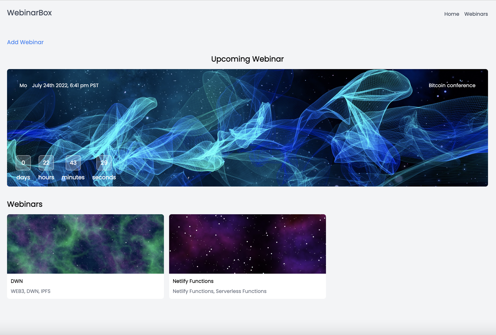

# React Netlify Functions

## Description

This project is an example of using React with Netlify Serverless Functions

<br />

<br />

## Quick start

1.  Clone this repo using `git clone https://github.com/mohamedsamara/react-netlify-functions.git`
2.  Move to the directory: `cd <PROJECT_NAME>`.<br />
3.  Run `yarn install` in order to install dependencies.<br />

## Start netlify dev

```
$ yarn start
```

## Start development

```
$ yarn dev
```

## Simple build for production

```
$ yarn build
```

## Preview production build

```
$ yarn preview
```

## Format with Prettier

```
$ yarn format
```

## Run Linter

```
$ yarn lint
```
